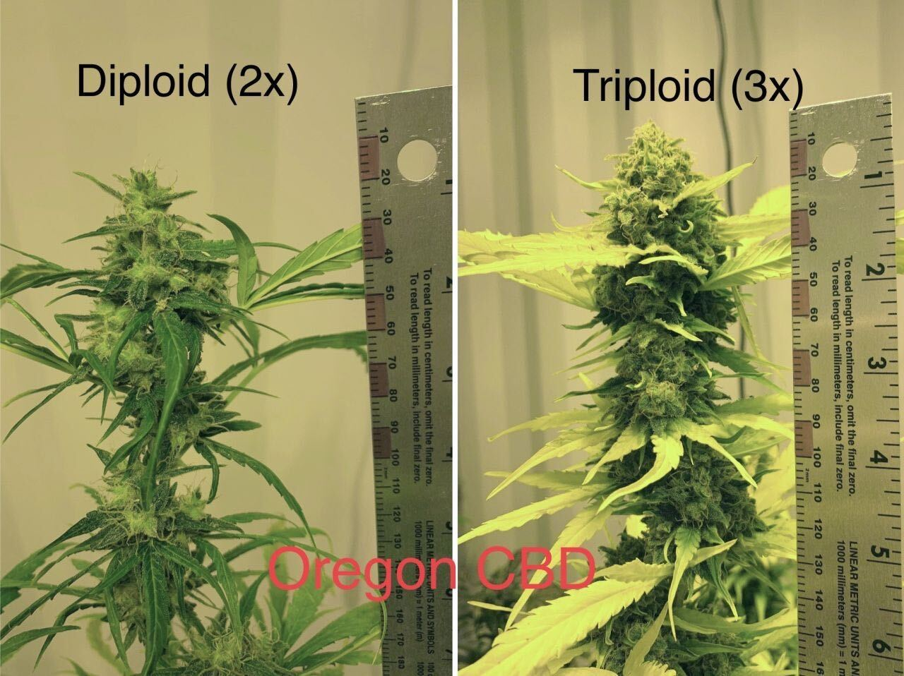
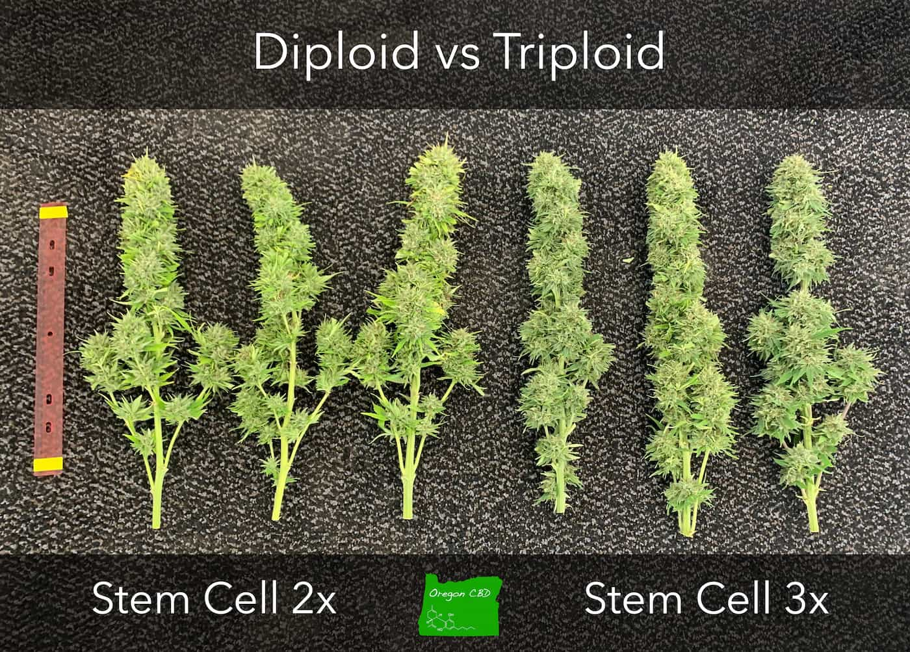
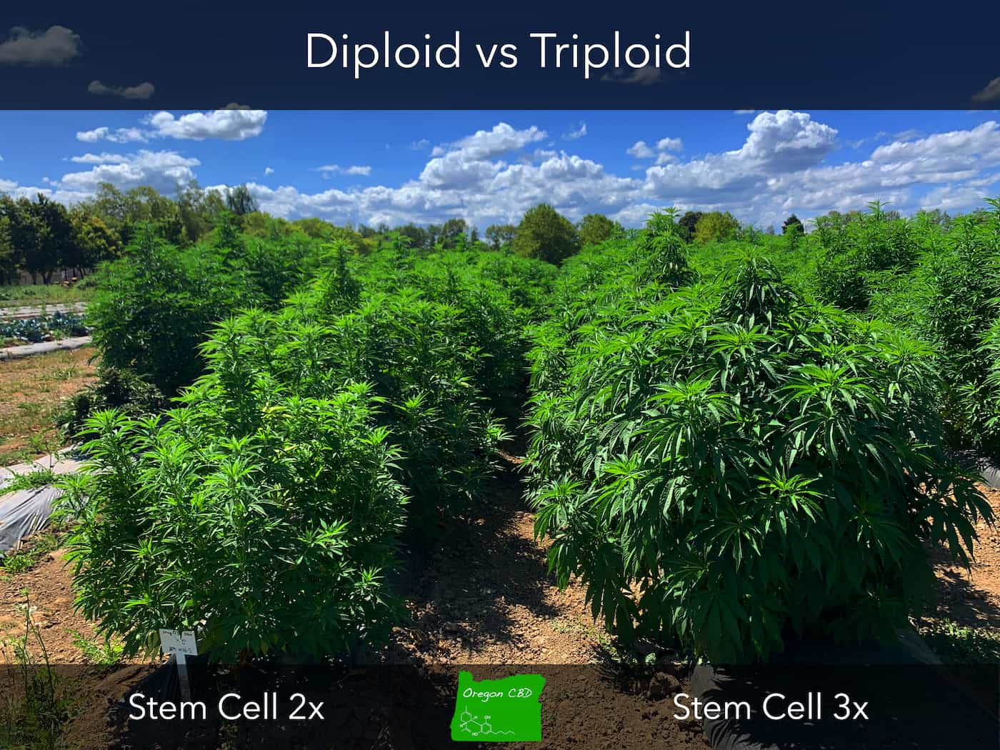
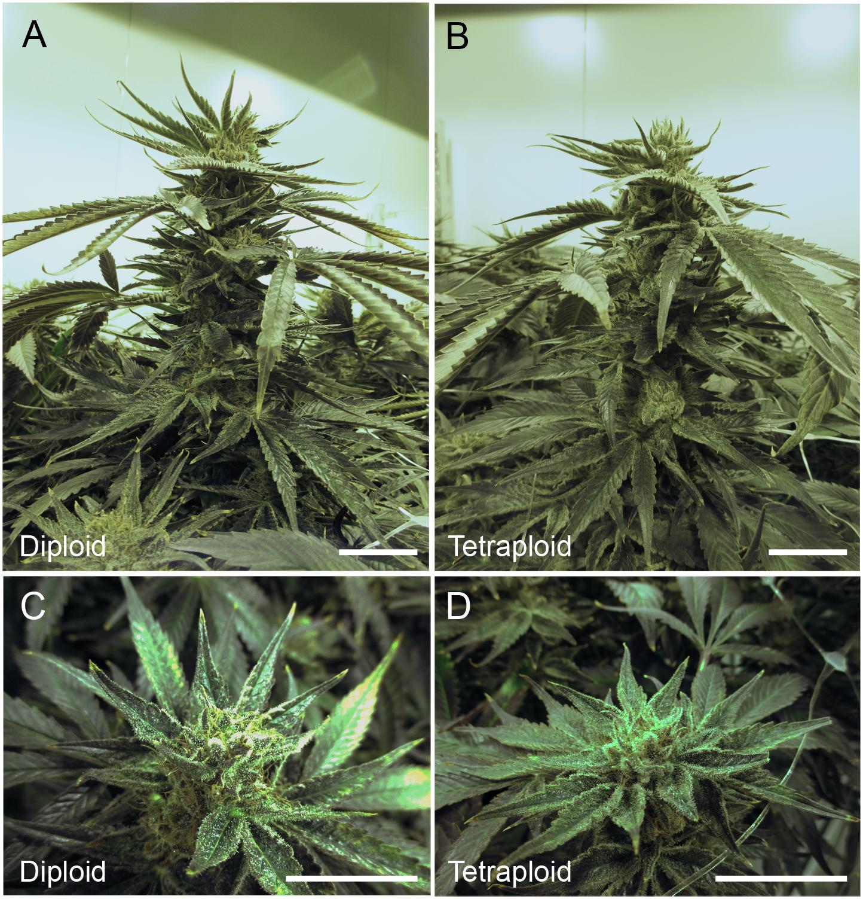

###
<h1 align="center">Bienvenidos al proyecto de SuperCannabis Argentino</h1>
<h2>
Primera genética de cannabis poliploide 
de desarrollo grupal por la comunidad canabica Argentina con uso y distribución libre

Hackeando cannabis desde Argentina
</h2>

<h2 align="left">🌱 Que es el SuperCannabis poliploide?</h2>

###

El SuperCanabis es una genetica de cannabis seleccionada por su alta adaptacion a induccion poliploide la cual tiene varias ventajas en comparación con una planta de cannabis comun:

La diferencia entre las plantas de cannabis diploides y las polipoides se refiere a la cantidad de cromosomas que tienen. Una planta diploide tiene dos conjuntos completos de cromosomas (2n), el cannabis en la naturaleza es diploide, mientras que una planta polipoide tiene más de dos conjuntos (n+n) de cromosomas. Esto puede ocurrir debido a una mutación o a un cruce entre diferentes variedades de cannabis (algo poco normal). Las plantas polipoides tienen características diferentes a las plantas diploides, cómo un mayor contenido de THC, mayor tamaño y aumento el ratio de flores vs hojas.
###
1. Las plantas poliploides tienden a ser más grandes y más fuertes que las plantas diploides, lo que las hace más resistentes a enfermedades y plagas.
2. Tienden a tener un mayor rendimiento en términos de producción de flores y resina.
3. Las plantas poliploides tienden a ser más tolerantes a condiciones de estrés ambiental, cómo sequías o heladas.
4. Mejor calidad de produccion tienen una mejor calidad de flores y semillas, con mayor volumen y una mejor apariencia.
5. Mejor adaptación, las plantas poliploides se adaptan mejor a diferentes condiciones ambientales y requerimientos de cultivo.
6. Mayor variabilidad genética: ellas tienen una mayor variabilidad genética debido a los cromosomas adicionales, lo que puede ser útil en programa de selección y mejora genética.
7. La plantas con cromosomas impares (triploides por ejemplo) son estériles! El macho del vecino no nos puede polinizar.

<h6 size=small align='center'>

Ejemplos de Cannabis triploide fuente: [Oregon CBD USA](https://oregoncbdseeds.com/triploids/)

 

Comparacion de cannabis diploide normarl vs polipoide mutada fuente: [Polyploidization for the Genetic Improvement of Cannabis sativa](https://github.com/LaHuertaDelDiablo/SuperCannabisArgentino/blob/main/papers/Polyploidization%20for%20the%20Genetic%20Improvement%20of%20Cannabis%20sativa.pdf)

</h6>

###

<h2 align="left">🤔 Porque es un proyecto grupal para la comunidad canabica Argentina?</h2>

###

La investigación de poliploides comenzó en 1911, el botánico estadounidense Luther Burbank quería mejorar una pera, estos trabajos se siguen realizando hoy en dia en laboratorios de todo el mundo, muchas universidades publican papers con estudios sobre inducción a poliploide en plantas de cannabis obteniendo resultados increíbles.

En el repositorio de archivos, pueden acceder a muchos de estos papers universitarios sobre mutar cannabis a poliploide para mejorarla, les funciona bien pero se puede mejorar, TODOS TIENEN EL MISMO PROBLEMA, solo realizan las pruebas sobre 6 o 12 plantas de la misma genética, incluso usan clones de la misma planta madre esperando resultados diferentes.

Nosotros, cómo cultivadores, conocemos la variabilidad de genotipos y fenotipos en el cannabis, realizando pruebas de inducción diploide en forma hogareña descubrímos que cada genética responde en forma totalmente diferente, la clave es encontrar la que mejor responda y genere una producción multiplicada x 3

La comunidad canabica Argentina en forma grupal, va a replicar un protocolo de laboratorio de inducción poliploide en nuestras casas, siguiendo un procedimiento sencillo podemos amar una base con los resultados entre cientos de genéticas y miles de fenotipos.
esto va a ser un procedimiento científico llevado adelante por no científicos, pero tenemos una ventaja muy grande con respecto a un experimento controlado en una universidad, nosotros sabemos cultivar, tenemos una cantidad gigante de genéticas tanto locales cómo importadas, bancos de desarrollo de semillas que pueden colaborar y un mapa con variabilidad climática que nos va a permitir probar las genéticas en muchas condiciones diferentes.

Además contamos con el apoyo del programa Reprocann lo cual nos permite realizarlo en un entorno legal.

<b> <i>
Somos una comunidad nueva y en desarrollo, con un potencial increíble, Argentina tiene que estar ubicada número UNO en cualquier actividad relacionada al agro, si intercambiamos conocimiento y trabajamos juntos vamos a obtener resultados extraordinarios.
Vamos a poner a Argentina en el podio de la producción de cannabis de calidad a nivel mundial.
</b>  </i>

###

<h2 align="left">🤝 Cómo puedo participar?</h2>

###
Es muy fácil!

Tenés que cultivar 2 plantas de la misma genética, la que más te guste, una la vas a mutar a poliploide siguiendo un video instructivo, la otra va a quedar normal, durante el ciclo de cultivo tenemos que controlar los cambios entre la planta mutada poliploide y la normal, para luego reportarlos en un formulario todos los meses.

Con esta información vamos a armar una base de datos pública con los resultados de todos los cultivadores y realizar comparativas que nos permitan seleccionar las genéticas que mejor se adaptaron a la mutación y pasar a  la segunda etapa de selección.

Vamos a reportar ítems cómo cantidad de flores, aspecto, medidas, cantidad de resina, cambios en los terpenos, resistencia a plagas y hongos, también va a incluir fotos de las plantas para poder compararlas. 

En el video instructivo vamos a mutar 3 plantas:

1. Una semilla germinada que tenga la raíz radicular a la vista (2 días de germinación tipo ovni) la cual va a ocasionar que toda la planta mute a poliploide.

2. Un clon chico donde vamos a mutar el ápice, esto muta toda la planta pero no las raíces.

3. Una planta con un mínimo de 2 ramas y 3 nudos donde vamos a mutar solo la punta apical de una sola de las ramas y todo el crecimiento apical desde ese punto va a mutar, pero no es resto de la planta, esta opción se puede aplicar en plantas de exterior

La opción 1 produce plantas mutadas con mayor variación, es la que suelo usar y me da mejores resultados.

La opción 2 nos permite notar mejor las diferencias de producción, al usar dos clones de la misma planta. Esto es lo que hacen los laboratorios, porque no lo hacemos nosotros con 3000 genéticas?

La opción 3 simplifica la comparación, ya que la rama mutada es la única que tenemos que comparar con el resto y permite participar en el proyecto con una sola por planta por genética.
###

<h2 align="left">🎯 Cuantas etapas tiene el proyecto?</h2>

###

El proyecto tiene 3 etapas 

1. Etapa: Búsqueda de las genéticas correctas.
   Con los datos de las plantas que mutamos, vamos a comparar resultados para seleccionar las genéticas y fenotipos que mejor respondieron a la mutación produciendo mayor cantidad de flores y resina.

2. Etapa:  Distribuir las genéticas seleccionadas para confirmación.
   cómo comunidad vamos a distribuir clones/semillas de las genéticas seleccionadas para volver a mutarlas en diferentes zonas climáticas y condiciones de cultivo, repitiendo el protocolo con una cantidad limitada de genéticas seleccionadas por un alto nivel de respuesta a la mutación.

3. Etapa: Selección en forma grupal de la genética ganadora. 
   Sería ideal realizarlo en alguna copa de cata) y definirla cómo genética base para el SuperCannabis Argentino. Tendríamos que determinar entre cuantas de las genéticas que mejor respondieron para seleccionar a la ganadora y definir el resto para hacer variaciones del supercannabis principal.

Desde este punto la posibilidad de crecimiento es infinita, tendríamos una base de superproduccion tanto para desarrollar el cultivo medicinal personal cómo para la industria, con técnicas de cultivo avanzadas cómo enjaulado se pueden obtener producciones de 3 kilos de flores secas por planta, en caso de ser plantas poliploides se podría sobrepasar los 5 kilos de producción seca por planta en el entorno correcto.

###

<h2 align="left">🤔 Porque va a ser una genética de uso libre y gratuito?</h2>

###

El resultado de este proyecto (la genética) va a quedar bajo licencia Creative Commons.

Algo con licencia CC (Creative Commons) es un trabajo creativo, cómo una imagen, música, video, literatura, (ahora una semilla?), que ha sido liberado bajo una de las varias licencias de Creative Commons. Estas licencias permiten a otros utilizar, compartir y modificar el trabajo de manera legal y gratuita.
Al mismo tiempo nadie puede registrarlo para sí mismo, es una planta, tiene que ser libre.
(buscamos abogados que puedan colaborar en este tema)

###

<h2 align="left">🤔 Necesito equipo de laboratorio para mutar la planta?</h2>

###

NO! Vamos a usar cosas simples, frascos, un gotero, servilletas de papel y un medicamento que se consigue en la farmacia para realizar la mutación.

###

<h2 align="left">🤔 Hay algún requerimiento para participar?</h2>

Tener ganas de cultivar, curiosidad y el Reprocann al día.

###

<h2 align="left">🤔 Cuanto cuesta participar? Se cobra por ver los tutoriales?</h2>

NO! Esto tiene que ser todo gratis, es de la comunidad para la comunidad, vamos a poner a Argentina cómo uno de los  mejores productores de Cannabis en el mundo.

###

<h2 align="left">🌱 Hay poyectos comerciales con cannabis poliploide en otros paises?</h2>

Estos son solos algunas de las compañías extrajeras que se presentaron cannabis poliploide en el 2022

Que esperamos para ser los primeros en América Latina? ¡Argentina tiene sangre de campo!

La compañía [Oregon CBD](https://oregoncbdseeds.com/triploids/) en USA por ejemplo tiene la mayor producción de plantas triploides de alto CBD del mundo, estas plantas producen el doble de flores que una planta normal, 

La compañía [Dark Heart Industries](https://darkheartindustries.com/bioscience/) en 2022 anuncia el primer cannabis polipoide sin semillas del mundo para productores comerciales

La compañía [Dutch Passion](https://dutch-passion.com/en/blog/the-seedless-triploid-cannabis-genetics-revolution-n1117) esta preparando su genetica poliploide en octubre del 2022

Las mutaciones poliploides son el futuro para el desarrollo del cannabis.

Estas compañías internacionales están haciendo las investigaciones en grupos chicos, laboratorios de 3 o 4 personas, en entorno cerrados, dentro de la caja, nosotros podemos ser cientos, cultivamos mejor y tenemos más genéticas, podemos hacer algo superior y más rápido.
Vamos a hacer el mismo trabajo que ellos con una selección de fenotipos y condiciones mucho más amplia.

<h2 align="left">🌱 Que es una planta poliploide?</h2>

###

Una planta poliploide es aquella que tiene más de dos sets completos de cromosomas en sus células. El número de sets completos se conoce cómo ploidía. La ploidía más común en las plantas es diploide, que tiene dos sets completos de cromosomas (2n). Sin embargo, algunas plantas son triploides (3n), tetraploides (4n) y así sucesivamente.

La poliploidía puede ocurrir de forma natural o puede ser causada por la intervención humana. Por ejemplo, algunas plantas poliploides se producen a través de la hibridación natural entre especies relacionadas, mientras que otras son el resultado de tratamientos químicos o radiación que aumentan el número de cromosomas en una planta.

Las plantas poliploides a menudo tienen características distintivas que las diferencian de las diploides, cómo tamaño de hoja y flor mayor, mayor resistencia a enfermedades y plagas, y mayor productividad

<h2 align="left">🌱 Porque se pueden crear plantas que no puedan ser polinizadas?</h2>
Algunas plantas poliploides no pueden fertilizarse debido a que no tienen parejas cromosómicas completas para formar células reproductoras fértiles.
Esto se debe a que tienen un número impar de cromosomas, triploides por ejemplo, lo que significa que no pueden formar células reproductoras con la misma cantidad de cromosomas.

En los cultivos de cannabis las perdidas en por errores de polinización son enormes, con esta técnica se soluciona este problema tanto en cultivos comerciales como en el cultivo medicinal hogareño.

<h2 align="left">🌱 Como se reproduce una planta con cromosomas impares?</H2>

Hay varias formas en que una planta con cromosomas impares puede reproducirse. Una de ellas es mediante la reproducción asexual como la propagación por esquejes o micropropagación.

Otra forma es mediante la reproducción sexual pero utilizando técnicas como la auto-fecundación revirtiendo sexo.

###
<h2 align="left">🌱 Cómo se muta a poliploide una planta?</h2>

###

Hay varias formas de inducir la poliploidía en las plantas, algunas de las cuales incluyen:

Oryzalin es un herbicida que se utiliza para inhibir la división celular durante la meiosis, lo que resulta en la formación de células poliploides. Esta técnica se ha utilizado principalmente en plantas cultivadas, cómo cereales, para aumentar el tamaño y la resistencia de las plantas. Sin embargo, también se utiliza en investigación para estudiar el efecto de la poliploidía en la biología de las plantas.

Colchicina es un alcaloide presente en varias plantas, que se utiliza para inducir la poliploidía al inhibir la división celular durante la meiosis. Esto resulta en células con más de dos sets completos de cromosomas.

Trisporic acid es un compuesto de azufre que se utiliza para la inducción de poliploidía en plantas.

Mitomicina C es un agente quimioterapéutico que se utiliza para la inducción de poliploidía en plantas.

Cloruro de colina es un compuesto orgánico que se utiliza para la inducción de poliploidía en plantas.

Nitrosoureas son una clase de compuestos químicos que se utilizan para la inducción de poliploidía en plantas.

Benomil es un fungicida que tambien se ha utilizado para la inducción de poliploidía.

Rayos X e ionizantes, la exposición a rayos X e ionizantes también puede causar cambios en el número de cromosomas en una planta, lo que resulta en poliploidía.

Hibridación entre especies relacionadas también puede resultar en poliploidía, ya que los cromosomas de las dos especies se combinan para formar una nueva planta con más de dos sets completos de cromosomas.

Micro-propagación Es un proceso de multiplicación vegetativa que consiste en cultivar tejidos de una planta en medios artificiales de cultivo. Este proceso puede ser utilizado para generar plantas poliploides, mediante el uso de reguladores del crecimiento.

Es importante tener en cuenta que no todas las plantas son susceptibles a ser inducidas a poliploidía y que el proceso puede requerir varios intentos antes de lograr una planta poliploide viable.

###

<h2 align="left">🌱 Que método vamos a usar para mutar a poliploide?</h2>

###

Vamos a realizar inducción de la poliploidía mediante el uso de colchicina es un proceso utilizado para aumentar el número de cromosomas en una planta. La colchicina es un alcaloide presente en varias plantas, que se utiliza para inducir la poliploidía al inhibir la división celular durante la meiosis. Esto resulta en células con más de dos sets completos de cromosomas.

En la primera etapa elegimos usar colchicina que es un medicamento utilizado para el tratamiento de la enfermedad de gota, se puede comprar en la farmacia, es fácil de conseguir en Argentina y el riesgo al manipularlo es bajo

El proceso de inducción a poliploide con colchicina generalmente implica el siguiente procedimiento:

Selección de plantas: se seleccionan plantas jóvenes y sanas para el tratamiento

Preparación de la solución de colchicina: La colchicina se disuelve en una solución acuosa al 0,1-0,2%

Tratamiento: El tallo o las raíces de las plantas se sumergen en la solución de colchicina durante un período de tiempo determinado (generalmente varias horas a varios días)

Crecimiento de las plantas: Una vez tratadas, las plantas se colocan en condiciones de crecimiento adecuadas para el desarrollo de las células poliploides.

Es importante destacar que el proceso puede variar dependiendo del tipo de planta y el objetivo específico de la inducción, y que no todas las plantas son susceptibles a ser inducidas a poliploidía, y puede requerir varios intentos antes de lograr una planta poliploide viable.

###

<h2 align="left">🤔 Esto tiene una base científica?</h2>

###
Claro que si!

La inducción de la poliploidía mediante el uso de colchicina fue descubierta por el botánico estadounidense Lionel de la Torre (1899-1978) y el botánico colombiano-estadounidense Harold E. Moore Jr. en el año 1923. Los dos botánicos trabajaron juntos en la Universidad de Colombia en Nueva York (ahora conocida cómo Fordham University) y descubrieron que la colchicina podía causar la poliploidía al inhibir la división celular durante la meiosis.

Posteriormente, la colchicina se ha utilizado en una variedad de plantas para inducir la poliploidía, incluyendo cereales, plantas forrajeras, flores, frutas y vegetales, y ha sido esencial para el desarrollo de nuevas variedades y la mejora de las existentes.

Algunos ejemplos de plantas poliploides exitosos incluyen:

1. El trigo, que es hexaploide (tiene seis copias de cada cromosoma) y es uno de los cultivos más importantes del mundo.

2. El algodón, que es octoploide (tiene ocho copias de cada cromosoma) y es uno de los principales cultivos industriales.

3. La patata, que es tetraploide (tiene cuatro copias de cada cromosoma) y es un cultivo alimenticio importante en todo el mundo.

4. La cebada, que es hexaploide (tiene seis copias de cada cromosoma) y es utilizada para producir cerveza y otros productos.

5. El lirio, que es octoploide (tiene ocho copias de cada cromosoma) y es una planta ornamental popular.

En general, las plantas poliploides tienden a ser más grandes y resistentes, y pueden tener mejores rendimientos. Por eso son cultivos importantes en la agricultura moderna.

###

<h2 align="left">📝 Hay publicaciones cientificas sobre esto?</h2?

###

Aquí hay algunos ejemplos de papers o estudios científicos que han investigado el uso de colchicina en la inducción de la poliploidía en plantas de cannabis:

"Induction of tetraploidy in Cannabis sativa L. by colchicine treatment" (2001) publicado en el International Journal of Plant Science. Este estudio demostró que la colchicina es eficaz para inducir la poliploidía en plantas de cannabis y que los individuos poliploides presentan un mayor tamaño de las hojas y las flores.

"Development of a tetraploid cannabis variety with increased yield and THC content" (2013) publicado en Journal of Industrial Hemp. Este estudio utilizó colchicina para inducir la poliploidía en plantas de cannabis y encontró que las plantas poliploides tenían un mayor rendimiento y un mayor contenido de THC.

"Development of tetraploid plants of Cannabis sativa L. using colchicine treatment" (2015) publicado en Industrial Crops and Products. Este estudio también encontró que la colchicina es eficaz para inducir la poliploidía en plantas de cannabis y que las plantas poliploides tienen un mayor tamaño y rendimiento.

"Development of tetraploid Cannabis sativa L. using colchicine treatment" (2016) publicado en Journal of Applied Research on Medicinal and Aromatic Plants. Este estudio también mostró que la colchicina es eficaz para inducir la poliploidía en plantas de cannabis y que las plantas poliploides tienen un mayor tamaño y rendimiento.

Si querés aprender más sobre la mutacion poliploide hay varios papers sobre el tema en [/papers/](https://github.com/LaHuertaDelDiablo/SuperCannabisArgentino/tree/main/papers)

<h2 align="left">🤔 Al hacer esto soy cómo Monsanto?</h2>

###

Claro que no! Es más ser cómo el Profesor Xavier o cómo Magneto!

Mutar frutas o flores a poliploide se hace muchos años, las bananas que compramos en el súper son poliploides creadas por el científicos, las originales tienen semillas!

Cuando comes una frutilla enorme es un poliploide creado por alguien, las naturales son muy chiquitas y llenas de semillas duras.

Esto es evolución

<h2 align="left">📝 En que estado está el proyecto?</h2>

###

**Esto es una presentación, necesito apoyo de la comunidad para poder realizarlo, si llegamos a 100 o 200 cultivadores con ganas de participar armo un reel en Instagram con la lista de materiales y podemos hacer el primer vivo explicando la técnica a fines de enero.**

**Pueden confirmar la participación con un comentario en la destacada de Supercannabis Argentino en el Instagram de @lahuertadeldiablo o enviar un dm**

**Si querés involucrarte más en el proyecto vamos a necesitar mucha ayuda, acá hay una lista de tareas en las que podés participar**

Tareas en las que vamos a necesitar colaboracion:

- [ ] La ayuda de toda la comunidad canabica para hacer las pruebas A/B con plantas mutadas
- [ ] Influencers cannabicos que puedan apoyar y dar a conocer el proyecto
- [ ] Bredders que nos ayudan a probar varias genéticas en paralelo, este trabajo les sirve al mismo tiempo para desarollar sus propias semillas poliploides
- [ ] Abogadxs que nos asesoren en lo relativo a licencias cc/gnu y distribución de las plantas y semillas
- [ ] Organizadores de copas canabicas para ayudarnos en la selección de fenotipos mutados en la ultima etapa
- [ ] Científicxs / Médicxs / Ing. Agronomxs que quieran ayudar en el desarrollo de los protocolos de aplicación y control de resultados
- [ ] Diseñadxr para un logo y página web del proyecto
- [ ] Ayuda de ONGs canabicas para la viralización del proyecto, distribucion de clones y semillas
- [ ] Acceso a un análisis cromosómico para comprobaciones finales

Si se te ocurre otra forma de participar contactanos!

💬 dm en Instagram [@lahuertadeldiablo](https://www.instagram.com/lahuertadeldiablo/)

💬 email azrael@lahuertadeldiablo.com
